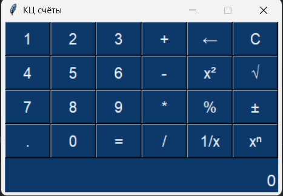

# КЦ счёты 🪐

> Калькулятор на Python в **одну строку** — весь файл, включая импорты, GUI 
> и логику вычислений. Назван в честь Кц из «Кин-дза-дзы», где 
> универсальный прибор для расчётов и торговли выглядел бы примерно так.

## 🎭 Что это

**Шутка, но с подвохом.** Задача была: написать полностью рабочий 
калькулятор с GUI, где **весь код — одна строка**. Никаких `eval`, 
никаких сторонних библиотек вроде `sympy` или `numexpr` и даже не использую ";". Только 
стандартный `tkinter` и чистый Python.

Побочный эффект: пришлось вспомнить всё, что знал о list comprehensions, 
лямбдах, генераторах, тернарных операторах, цепочках методов.

## 🚀 Возможности

- Сложение, вычитание, умножение, деление
- Возведение в квадрат (`x²`) и в степень (`xⁿ`)
- Квадратный корень (`√`), обратное число (`1/x`)
- Проценты, смена знака, десятичная точка
- Очистка (`C`) и удаление последнего символа (`←`)

## 🛠️ Стек

- **Python 3.10+**
- `tkinter` — GUI
- Никаких сторонних зависимостей
